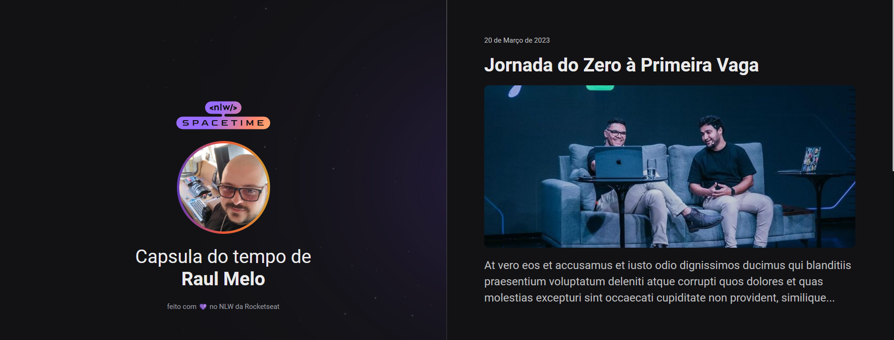

  

## 🖥️ Projeto
Esse é um projeto Web responsivo de uma capsula do tempo.

## 🚀 Tecnologias
Esse projeto foi desenvolvido durante a NLW da Rocketseat com as seguintes tecnologias:

- HTML
- CSS
- Git e Github

## 🖼️ Layout
Você pode visualizar o layout do projeto através [desse link](https://www.figma.com/file/iGqMEf6eYQNns1V3y9iMp8/C%C3%A1psula-do-tempo-%E2%80%A2-Trilha-Explorer-(Copy)?type=design&node-id=306%3A3&t=EBAU4TOpTy9XSXeG-1)

é necessário ter uma conta no [FIGMA](https://www.figma.com)